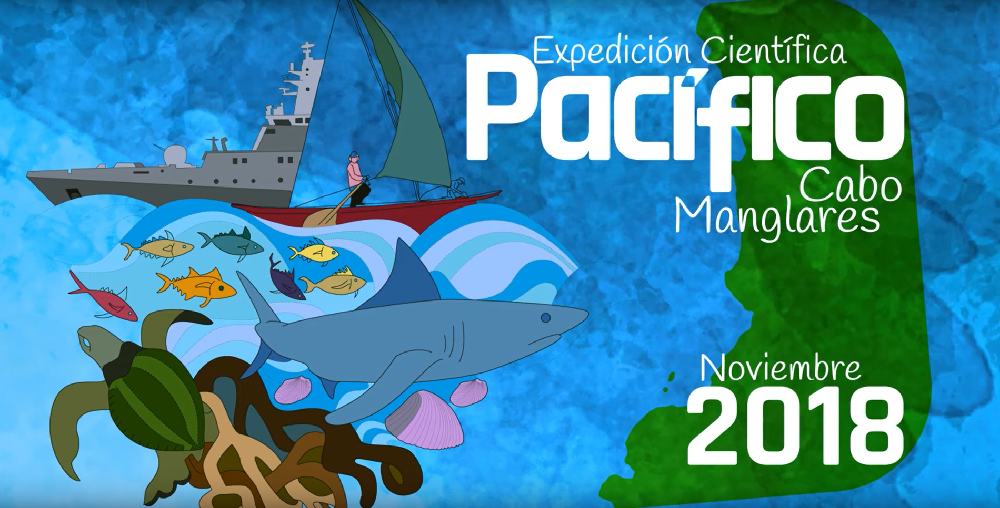

# Géneros de fitoplancton obtenidos en los eventos de pleamar y bajamar en la Expedición Pacífico 2018 - Distrito de Manejo Integrado (DNMI) Cabo Manglares.

## Plan Nacional de Expediciones Científica

El Programa Pacífico tiene como fundamento contribuir con la creación y el desarrollo de una conciencia colectiva que valore el territorio como un espacio vital, en el cual la pervivencia de los pueblos está sujeta a la interdependencia entre el mundo natural, humano y espiritual. La construcción de un Pacífico Sostenible implica el reconocimiento de las múltiples visiones que coexisten y, por tanto, que poseen derechos y deberes sobre la gestión y el manejo integral del territorio. Para esto, es necesario entender a profundidad el contexto natural y social desde el encuentro entre el conocimiento tradicional y el conocimiento científico, de tal forma que las estrategias de gobernanza se proyecten desde un entendimiento multidimensional, en el cual el ser humano es parte intrínseca del territorio ([Comisión Colombiana del Océano](https://pnec.cco.gov.co/)).

